# Raspberry Pi OSの設定

Raspberry Pi用のOSである Raspberry Pi OSの設定について説明します。  
Raspberry Pi本体は'Raspberry Pi4 ModelB'、
Raspberry Pi Imagerは、'Raspberry Pi Imager 1.7.3'、
OSは'Raspberry Pi OS Version 2022-09-22'で説明します。

## Raspberry Pi OSのインストール  

###	1. Class10のmicroSD(8～32G)を用意します。

*64GB以上のSDカードの場合、exFATでフォーマットされます。
Raspberry Pi OSはexFATに対応していませんので、別のツールを使ってFAT16またはFAT32でフォーマットする必要があります。*

### 2. Raspberry財団公式ホームページ(https://raspberrypi.org/software/)でRaspberry Pi Imager をダウンロードしてインストールします。

2-1. ダウンロードしたファイルをダブルクリックします。

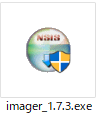  

2-2. [Install] をクリックします。

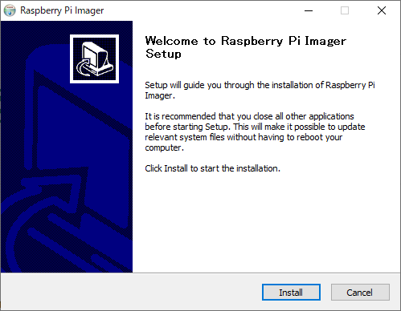  

2-3. 終了画面で[Finish]をクリックします。

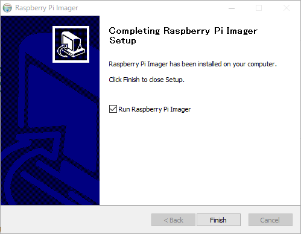  

### 3. Raspberry Pi Imager を使って Raspberry Pi OS のSDカードを作成します。

3-1. Raspberry Pi Imagerが起動すると以下の画面が表示されます。

   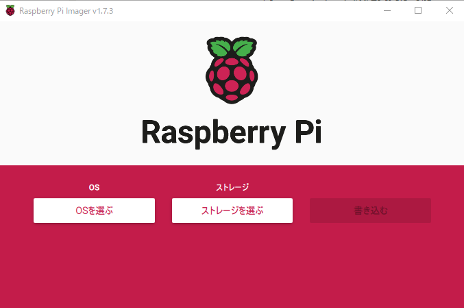  

3-2. [OSを選ぶ]をクリックして[Raspberry Pi OS (32-bit)]を選択します。

   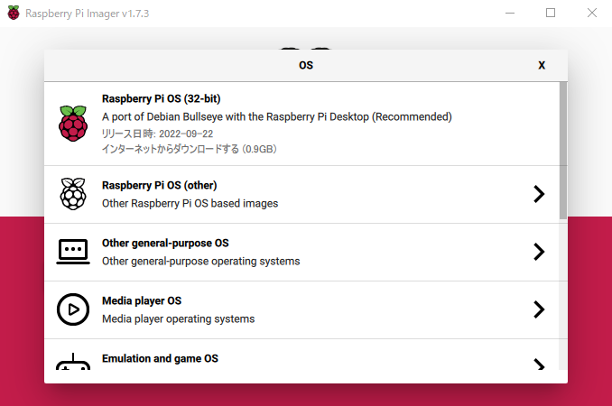 

3-3. [ストレージを選ぶ]をクリックして、書き込み先のデバイス（SD Card）を選択します。
 
  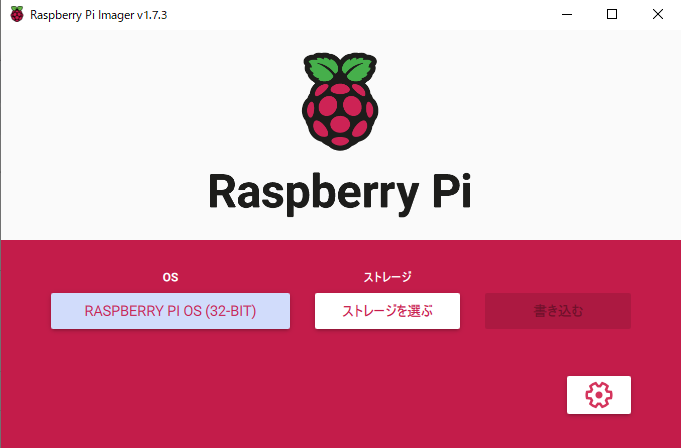 
  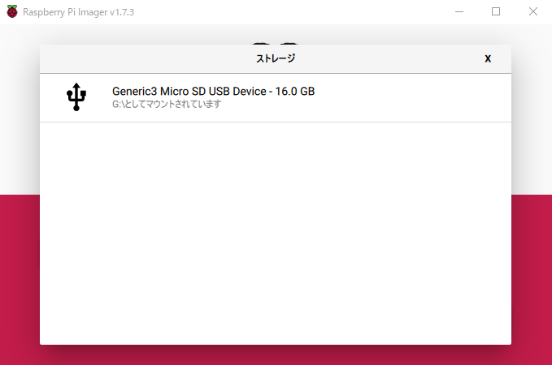 

3-4. [書き込む] をクリックします。

  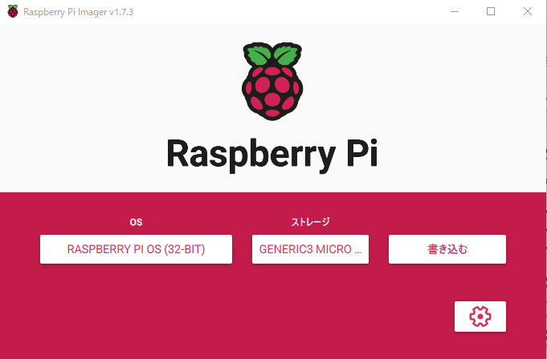 

3-5. 確認ダイアログ画面で [はい]を選択して、SD Cardへの書き込みを開始します。

  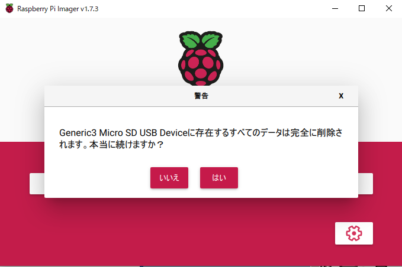 

3-6. 途中、書き込みの進捗状況が表示されます。

  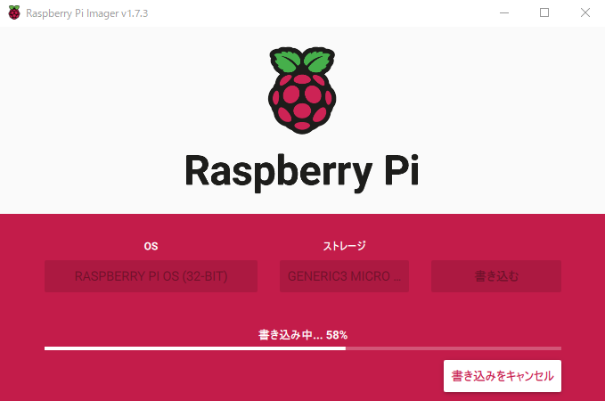 
  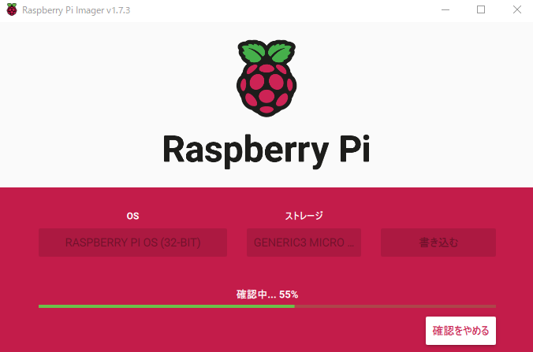 

3-7. 書き込みが終わると、以下の完了画面が表示されます。
　　[続ける] をクリックして、microSDカードを取り外します。

  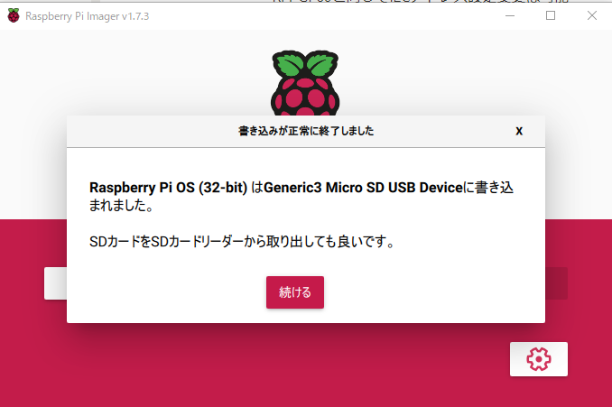 

### 4. OSの起動とI2Cの有効設定

4-1. microSDカードをRaspberry Pi基板に接続し起動します。  

   

4-2. [設定]-[ラズベリーパイシステムの設定]をクリックします。

  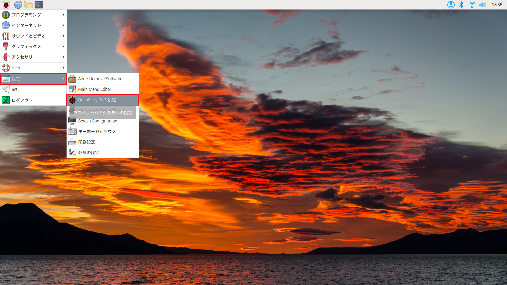 

4-3. [インターフェース]で"I2C"を有効にします。

   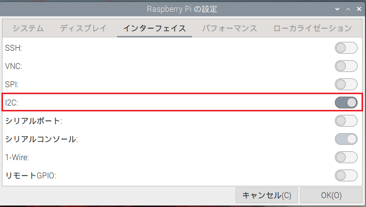  

設定を反映させるため、OSを再起動すれば、Raspberry Pi OS のインストールと設定は完了です。