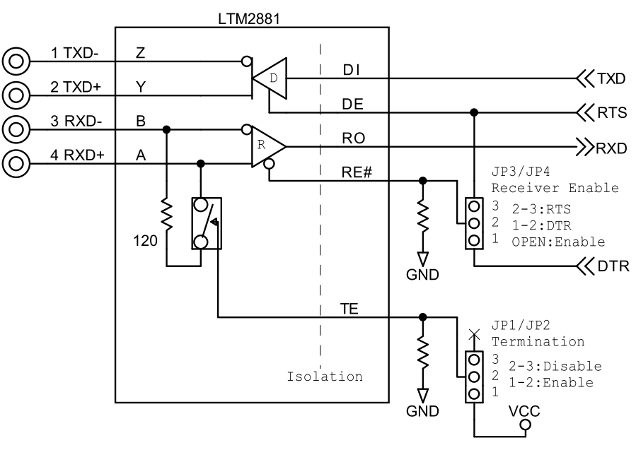
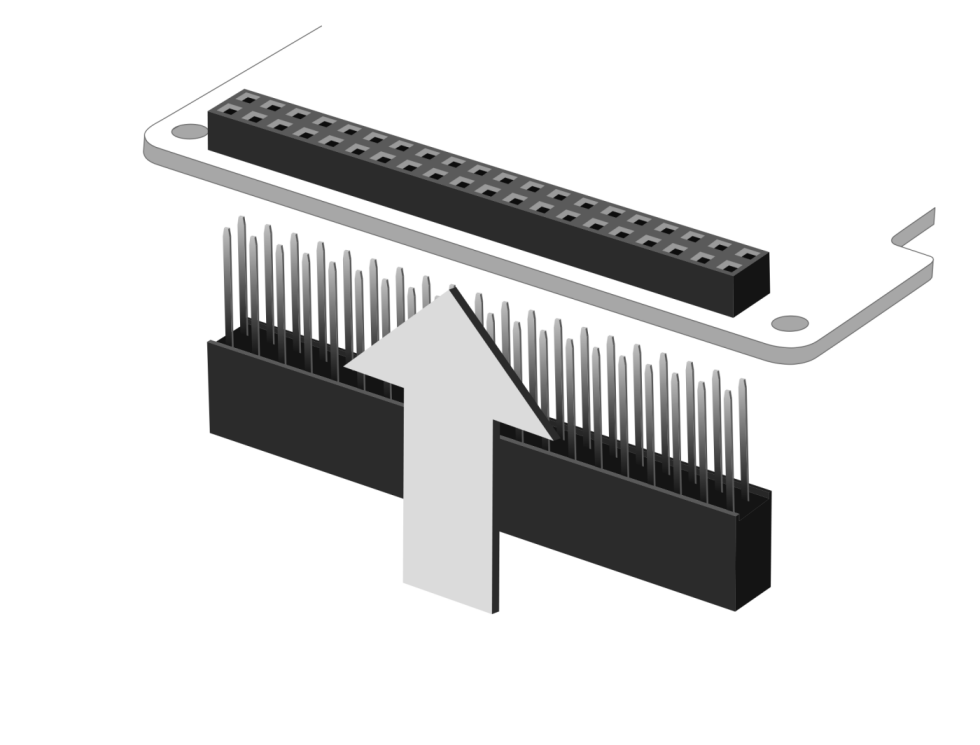

# RPi-GP70の設定と装着  
各種設定と本製品をRaspberry Pi GPIO 40PINに接続する方法を説明します。  

___  
## 1. 各種ハードウェア設定

### 1-1. I2Cアドレスの設定(A0/A1)
  

シリアルコントローラSC16IS752のI2Cアドレスを、半田ジャンパ(A0, A1)のオープン/ショートによって設定変更できます。  
※初期設定は`0x4D`(A0～A1オープン)です。  

|A1|A0|I2Cアドレス||
|:--:|:--:|:--:|:--:|
|オープン|オープン|0x4D|※初期設定|
|オープン|ショート|0x4C||
|ショート|オープン|0x49||
|ショート|ショート|0x48||

### 1-2. 終端抵抗の設定(JP1/JP2)


RS485/422の差動レシーバに120Ω終端抵抗の無効/有効を設定します。
基板上のジャンパ設定ピンJP1でPort0(CN1),JP2でPort1(CN2)のポート毎に設定をします。
出荷時設定は2－3ショート(終端抵抗無効)です。  


|JP1/JP2<br>ピン設定|機能・説明|
|:--:|:--|
|1-2 ショート|終端抵抗有効※|  
|2-3 ショート|終端抵抗無効|  

※終端抵抗は絶縁電源がONの時に有効となります。

### 1-3. 受信制御信号の設定(JP3/JP4)  


基板上のジャンパ設定ピンJP3でPort0(CN1),JP4でPort1(CN2)のRS485/RS422の受信制御信号を設定します。
出荷時設定はオープン(常に受信有効)です。


|JP3/JP4<br>ピン設定|機能・説明|
|:--:|:--|
|1-2 ショート|DTR制御（DTR OFFで受信有効）|
|2-3 ショート|RTS制御（RTS OFFで受信有効）|
|オープン|常に受信有効|


### 1-4. RS485/422ドライバ/レシーバ  
RS485/422のドライバ/レシーバ部の回路構成です。  
  


### 1-5. RS485半二重接続例  
デージーチェーン接続された複数のドライバとレシーバで、双方向でのデータ伝送が可能です。（マルチポイント方式）  
最大32台のデバイスが接続できます。  
配線長が一番長くなる両端の終端抵抗を有効にし、それ以外の終端抵抗は無効にしてください。  
また、電線にツイストペアケーブルを使用することで、電磁誘導などによるコモンモードノイズを差動レシーバによって効率的に除去できます。  
 

RS-485の半二重の送信・受信

|機能|RTS/DTR制御|
|:--:|:--|
|送信|RTS ON|
|受信|JP3/JP4の設定参照|


### 1-6. RS485/422全二重接続例  
一つのマスタに対して複数のスレーブを接続できます。ドライバ１台に最大10台のレシーバが接続できます。（マルチドロップ方式）  
配線長が一番長くなるレシーバの終端抵抗を有効にして、それ以外のレシーバの終端抵抗は無効にしてください。  
また、電線にツイストペアケーブルを使用することで、電磁誘導などによるコモンモードノイズを差動レシーバによって効率的に除去できます。  
  

RS-485の全二重の送信・受信

|機能|RTS/DTR制御|
|:--:|:--|
|送信|RTS ON|
|受信|JP3/JP4の設定参照|


### 1-7. RS-485/422 各規格の比較  
規格上は以下のように定められていますが、実際の使用環境では最大値を下回る場合があります。  

|項目|RS-485|RS-422A|  
|:--|:--|:--|  
|準拠規格|TIA/EIA-485-A|TIA/EIA-422-B|  
|端子配列規格|独自|独自|  
|動作モード|平衡型 (差動)|平衡型 (差動)|  
|最大接続可能台数|32ドライバ、32レシーバ<br>半二重でのマルチポイント方式に対応|1マスタドライバに10スレーブレシーバ<br>全二重でのマルチドロップ方式|  
|最大ケーブル長(規格値)|1200m<br>ツイストペアケーブルを推奨|1200m<br>ツイストペアケーブルを推奨|  
|最大伝送速度(規格値)|10m - 35Mbit/s<br>1200m – 100kbit/s|1.2m – 10Mbit/s<br>1200m – 100kbit/s|  
|最大伝送速度(実力値)|920kbps|920kbps|  
|特徴|長距離のN対N通信<br>半二重/全二重|長距離の１マスタ対Nスレーブ通信<br>全二重|  
___  
## 2. 本体の組み立て  
製品付属の40PIN ピンヘッダーを本製品の底面より垂直に装着します。  
※40PINのピンヘッダーの先端は尖っていますので、怪我には十分ご注意ください。  

  

  


## 3. Raspberry Piボードとの接続  
Raspberry Pi 本体のGPIO ピンヘッダと本製品を接続します。  
スペーサー（付属）を本製品本体のネジ穴にあわせ、スペーサーを付
属のネジ（4 本）で固定し、そのままRaspberryPi のGPIO ピンへ垂
直に差し込みます。  
スペーサーがRaspberryPi 基板に合わされば接続は完了です。  
あとはRaspberryPi の背面より付属のネジ（4 本）を使用し、スペーサーを固定します。    
※反対側にも同じようにスペーサーとネジを使用し本体を固定してください。  

  


## 4. シリアルドライバ設定  
SC16IS752のI2CドライバはRaspberry-piに標準で用意されています。
以下の手順で登録することで、2つのシリアルポートがttyとして認識されます。  
### SC16IS752のI2Cドライバ登録と確認手順
1. config.txtをnanoで編集する  
    ```
    $ sudo nano /boot/config.txt
    ```

1. 次の2行を最終行へ追加する  
    ```
    gpio=27=op,dh
    dtoverlay=sc16is752-i2c,int_pin=17,addr=0x4d,xtal=14745600
    ```
    「1-1. I2Cアドレスの設定」でアドレスを変更している場合は、[addr=0x4d]を適宜書き換えてください。  

1. CTRL+Oで書き込み、CTRL+Xで終了する  

1. システムを再起動する

1. 再起動後、デバイスツリーに以下のttyポート[/ttySC0],[/ttySC1]が追加されていることを確認する
    ```
    $ ls /dev/ttySC*
    /dev/ttySC0  /dev/ttySC1
    ```